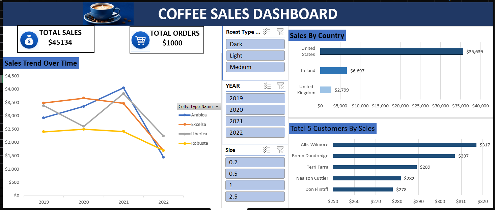

# Coffee Sales Dashboard — Excel

An interactive coffee sales dashboard built using Microsoft Excel to analyze sales performance across coffee types, roast types, sizes, countries, customers, and years.

## 📊 Dashboard Preview

## 🎯 Project Objective

The objective of this project was to transform coffee sales data into an interactive Excel dashboard that provides a clear overview of sales performance and helps identify trends across different coffee products, countries, and time periods.

## 🛠️ Tools & Skills

- Microsoft Excel
- Data Cleaning
- PivotTables
- PivotCharts
- Excel Slicers
- KPI Calculations
- Data Visualization
- Dashboard Design

## 📌 Key KPIs

- Total Sales
- Total Orders

## 📈 Dashboard Visualizations

- Sales Trend by Year
- Sales by Country
- Sales by Customer
- Coffee Type Performance
- Interactive Roast Type Filter
- Interactive Year Filter
- Interactive Size Filter

## 🔍 Key Insights

- The United States generated the highest sales among the countries shown.
- Sales performance varies across different coffee types and years.
- The dashboard allows users to interactively filter the analysis by roast type, year, and size.
- Customer-level sales analysis helps identify the highest-value customers.

## 📁 Project Files

- **[Excel Dashboard](coffeeOrdersData.Project%201.xlsx)** — Interactive Excel dashboard and underlying data.
- **Dashboard Preview** — Screenshot of the completed dashboard.

## 👨‍💻 Author

**Jasil Fayad**

Aspiring Data Analyst | Excel | SQL | Power BI | Tableau | Python
